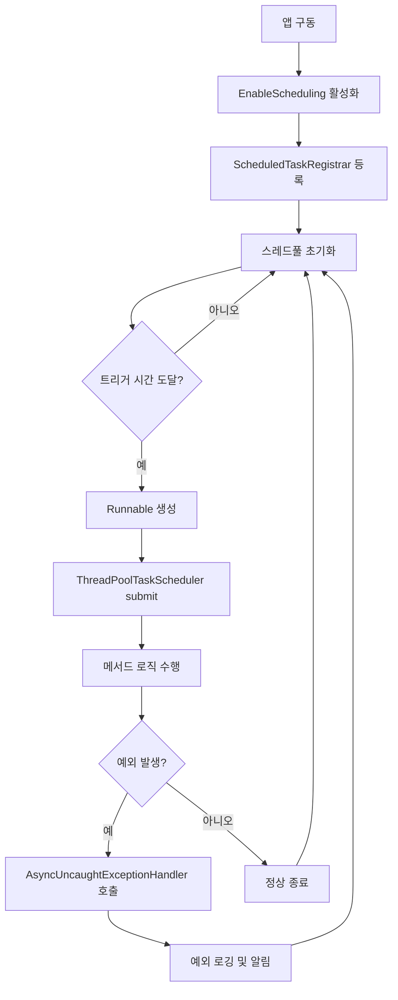

# deokhugam Project 🚀

## 📖 프로젝트 소개

    <h3><b>📚책 읽는 즐거움을 공유하고, 지식과 감상을 나누는 책 덕후들의 커뮤니티 서비스</b></h3>

 

> 코드잇 중급 프로젝트명: 덕후감(deokhugam)  
> 진행 기간: 2025.04.16 ~ 2025.05.12
> 주요 기능: 도서 이미지 OCR 및 ISBN 매칭 기능을 포함한 Spring 기반 백엔드 구축

 

## 🧑‍💻나의 담당 역할

| 분야        | 상세 내용                                                                  |
|-----------|------------------------------------------------------------------------|
| 백엔드 개발    | Spring Boot 기반 API 개발 - 알림 도메인 구현                                      |
| 인프라 & 배포  | AWS ECS, RDS, S3 환경 구성 및 CI/CD 설정, Secret Manager와 IAM 정책 커스텀, OIDC 인증 |
| 모니터링 구축   | Prometheus + Grafana 활용 서버 모니터링                                        |
| 테스트 코드 작성 | RestAssured, H2 DB 기반 통합, 단위 테스트 구현                                    |

 

## 🔍프로젝트 성과 및 회고

프로젝트를 진행한 후 회고를 정리하여 문서화했습니다.

### 🧩성과 및 회고 요약

본 프로젝트를 통해 개발, 배포, 운영 모니터링 등 전체 개발 프로세스를 경험하였습니다.   
특히, 다음과 같은 기술을 처음으로 적용하였습니다.

- AWS ECS Fargate를 활용한 컨테이너 기반 배포
- Spring Metrics, Prometheus, Grafana를 활용한 모니터링 시스템 구축

이외에도 다음과 같은 성과를 달성했습니다.

- Docker 이미지 최적화를 통한 빌드 효율성 향상
- AWS 서비스를 활용하여 보안 강화를 위한 키 관리 및 노출 방지
- Spring Metrics를 활용한 모니터링 도구 구성 및 스레드 처리 방식에 대한 학습

기술의 단순한 사용법을 익히는 것을 넘어, 관련 개념을 심도 있게 학습하고 성과를 비교 분석함으로써 개발 역량을 향상 시킬 수 있었습니다.

 

    
실제 Docker 최적화 관련 적용을 통한 최적화 결과 분석

    

 

### 👉 자세한 회고는 블로그에서 확인하실 수 있습니다!

### <a href="https://doitwojae.tistory.com/entry/2025-05-%EC%BD%94%EB%93%9C%EC%9E%87-%EC%A4%91%EA%B8%89-%ED%94%84%EB%A1%9C%EC%A0%9D%ED%8A%B8-%ED%9A%8C%EA%B3%A0" target="_blank">🔗 2025 코드잇 중급 프로젝트 회고</a>

 

## 🧠기억에 남는 PR 및 이슈

### 로그인 유저 주입 기능 리팩토링

- <a href="https://github.com/CodeitSB-Team9/sb01-deokhugam-team09/pull/78" target="_blank">PR #78: Resolver와 Interceptor를 활용하여 로그인 유저 관리를
  중앙 집중화하였습니다.
- PR에 사용 방법과 설명을 포함시켜 팀원들이 각자 필요한 곳에서 사용하였습니다.

  

 

팀원들이 쉽게 활용할 수 있도록 사용법을 문서화했으며, 각자의 기능에 적용해 활용했습니다.

 

### HTTP 상태 코드에 대한 이해 개선

- <a href="https://github.com/CodeitSB-Team9/sb01-deokhugam-team09/pull/70" target="_blank">PR #70: HTTP 상태 코드에 대한 잘못된 이해를 팀원들과 논의하며, 정확한
  개념을 정리했습니다.

    

 

### 예외 처리에 대한 논의

- <a href="https://github.com/CodeitSB-Team9/sb01-deokhugam-team09/pull/91" target="_blank">PR #91: 예상되는 예외 상황에 대해 코멘트를 남기고 팀원들과 소통함으로써, 보다
  견고한 예외 처리를 구현하였습니다.

    

 

## 👥팀원 소개

- 팀원 : 5명
- 팀장 : 김상호
- 팀원 : 김희수, 김효정, 공병열, 백재우

|                         |                            |                             |                             |                             |
|:---------------------------------------------------------------------------------------:|:---------------------------------------------------------------------------------------:|:----------------------------------------------------------------------------------------:|:----------------------------------------------------------------------------------------:|:----------------------------------------------------------------------------------------:|
|  |  |  |  |  |
|                           [김상호](https://github.com/ghtkdrla)                            |                        [김희수](https://github.com/kaya-frog-ramer)                        |                            [김효정](https://github.com/hyojKim2)                            |                          [공병열](https://github.com/byeongyeol12)                          |                           [백재우](https://github.com/jaewoo9797)                           |

 

## 🛠️기술 스택

 

### ⚙️ Backend

### 🗄️ Database & Infrastructure

### 🔁 CI/CD & 테스트

 

### 📊 모니터링

 

### 🔐 인증 & 보안

 
 

### 🧠 기타 기술

 
 

## Scheduler & Async

### 특정 시간대에 실행되는 스케줄러 플로우 차트

## 🗂 아키텍처 & ERD

<h3>Architecture</h3>

<h3>ERD</h3>

 

## 🚀CI / CD Flow

 
     
     
      
     

